I use Facebook every day — probably too much for my own good — and I’ve always been tempted to dive into their internals. That is, the Javascript code that produces much of the user interface and interactions.

A few months ago, I started thinking about the little status indicator that shows up when one of your friends is writing to you. It’s such an inconsequential UI addition, and yet it seems to reveal so much about your interlocutor. When it repeatedly blinks in and out of existence, it suggests hesitation. Have it linger on for a while, and they might be writing you an essay. And there’s nothing like that excruciating feeling when you watch it disappear, never to be seen again.


<div style="text-align: center;">
  <p></p>
  <p>
    <em>
      Look at that smug face. It’s taunting me, I know it!
    </em>
  </p>
</div>


One thing that got me intrigued was figuring out whether the data needed to display this indicator was sent to all members of a conversation regardless of them having it open. My first logical step was to open my network tab and start looking for signs of activity whenever someone was typing to me.


<div style="text-align: center;">
  <p>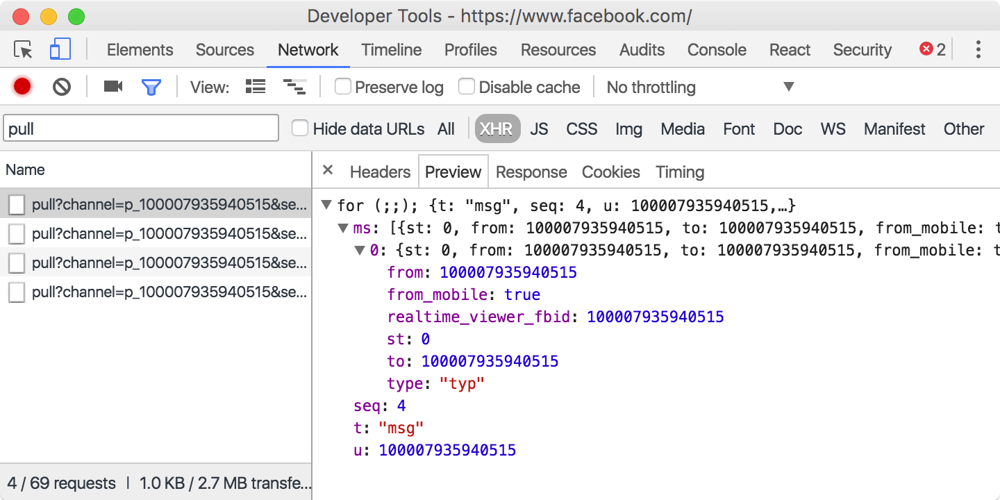</p>
</div>


And there it was! The theorized `typ` event, sent from the global Facebook long-polling `/pull` request. A little experimentation showed that this event was, indeed, sent for every conversation, even those I hadn’t held open, or never started.

While my snooping around could have stopped at that, I felt obligated to make something out of this discovery.

And thus I present to you my creepiest invention yet: the **Facebook Sixth Sense**. A Chrome extension that warns you whenever someone starts and stops typing to you. **June 9:** *removed from the Google Web Store in compliance with a Cease and Desist.*


<div style="text-align: center;">
  <p></p>
</div>


The rest of this blog post is dedicated to explaining how I used Facebook’s own private APIs in order to build this application.

## Un-minifying JavaScript

Nowadays, most big Javascript applications tend to minify their code by running it through tools such as [UglifyJs](http://lisperator.net/uglifyjs/) or [Google Closure Compiler](https://developers.google.com/closure/compiler/). While this is no bytecode, the compression ratio these tools achieve without ever altering the intended behaviour of the app is impressive. The user gets to the page in record time and the company saves bandwidth money. Everybody wins! 🎉

Except us.

Most of the readability of the original source code is lost. Local variable names are mushed to single letters, losing much of their meaning in the process, and any non-critical or redundant syntax gets thrown away or replaced with shorter alternatives. Goodbye whitespace, hello obscure syntax constructs!


<div style="text-align: center;">
  <p>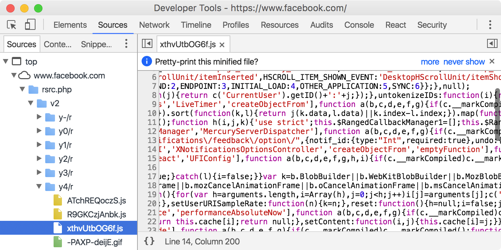</p>
  <p>
    <em>
      We end up with a few thousand characters long lines of nonsensical, jumbled mess of a code.
    </em>
  </p>
</div>


Don’t panic! We can restore some amount of sanity by adding back whitespace and indentation. In fact, the Chrome devtools even offer to do it for us!


<div style="text-align: center;">
  <p>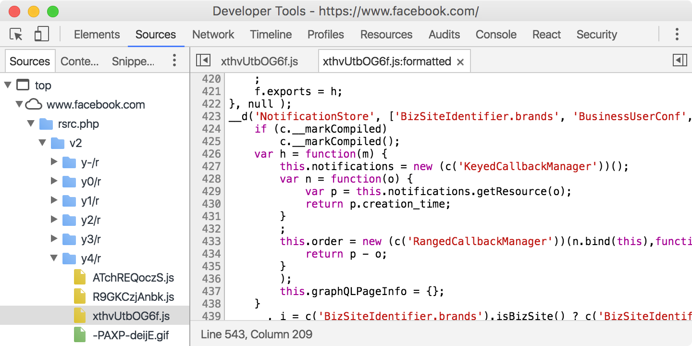</p>
  <p>
    <em>
      This almost looks sane.
    </em>
  </p>
</div>


Now we’re ready to start reading some code!

## Modules

Javascript still has no good module story. A standard is in the work, but none of the main browsers have implemented it. In the meantime, a few solutions have popped up, such as [Asynchronous Module Definition](https://github.com/amdjs/amdjs-api/blob/master/AMD.md) and [CommonJS](http://wiki.commonjs.org/wiki/Modules/1.1).

Well, as it turns out, Facebook has its own AMD solution. Modules are defined with the usual `__d(name, dependencies, factory)`. There ‘s also `require` and a `requireLazy` for importing modules.

I’d tell you to try it yourself on Facebook, but they have a big warning sign telling you not to copy and paste untrusted code into your console. Which is a very good idea. Don’t do this, okay?


<div style="text-align: center;">
  <p>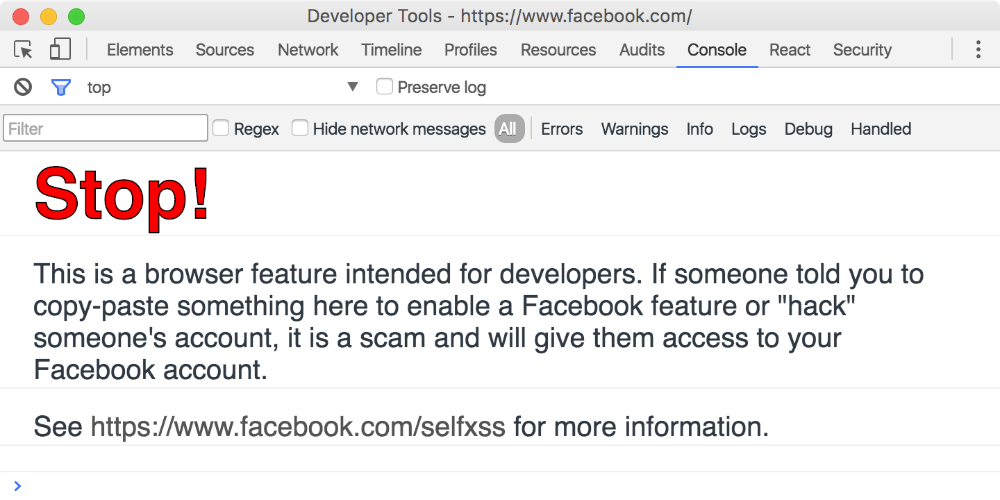</p>
  <p>
    <em>
      Wow, this Facebook guy sure sounds like a serious fella. Better not mess with him.
    </em>
  </p>
</div>


Who am I kidding, let’s tinker!

```
> require('React')
// Object {Children: Object, PropTypes: Object, DOM: Object, version: "16.0.0-alpha"}
```

Yep, Facebook always runs the [master branch](https://github.com/facebook/react) of React. That’s pretty ballsy. But also really cool.

You can search for `__d(` in the Sources tab to find out all the modules that are currently available to import. Use Ctrl+Shift+F or Option+Shift+F to search in all the source files. As you’ll find out, there’s a bunch of them!


<div style="text-align: center;">
  <p>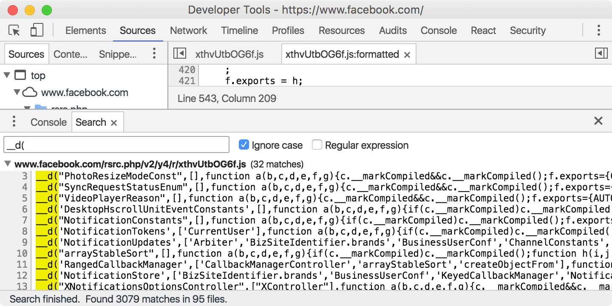</p>
  <p>
    <em>
      Only 3000 modules? Amateurs. (and that’s only for the front page!)
    </em>
  </p>
</div>


## React All The Things

By now you’ve probably heard about [React](https://github.com/facebook/react). It’s a pretty cool library from Facebook that lets you define your view components declaratively, in full Javascript. I’m not here to sell it to you, but if you haven’t already, go check it out!

As you might have deduced from that part about modules, Facebook use React on their main website, and quite extensively so. [In October 2015, they already had over 15,000 React components](https://facebook.github.io/react/blog/2015/10/07/react-v0.14.html#upgrade-guide)!

Another good thing about React components is that, when written properly, they’re very well compartmentalised. That is, their dependencies are explicit and they mostly opt to do one thing, and do it well. This property is going to be of great use to us in the rest of our adventure!

## Tracking Game

In case you’ve forgotten, we’re trying to intercept the typing notifications from our (soon not to be) friends. Let’s start with where it all begins: the chat box.


<div style="text-align: center;">
  <p>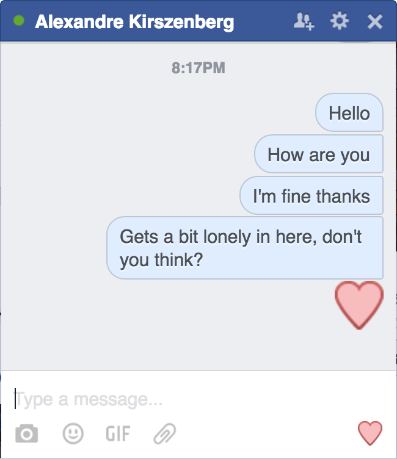</p>
  <p>
    <em>
      I have real friends, I swear.
    </em>
  </p>
</div>


Remember that part about React components? Well, the Messenger chat box is one of them. And there’s one great trick to inspect it in more details: the [React Devtools](https://chrome.google.com/webstore/detail/react-developer-tools/fmkadmapgofadopljbjfkapdkoienihi?hl=en).

Click on the chat box, choose `Inspect`, then go to the `React` tab of your Chrome devtools. Tada! You’re in React land now!


<div style="text-align: center;">
  <p>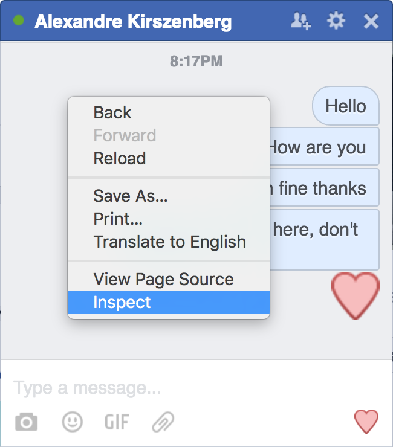</p>
  <p>
    <em>
      Inspecting away.
    </em>
  </p>
  <p>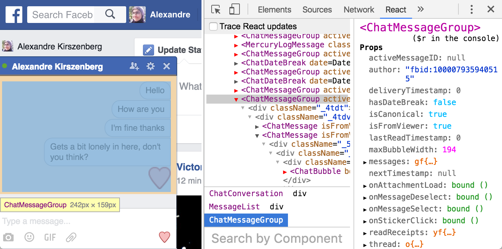</p>
  <p>
    <em>
      Honestly, how cool is that?
    </em>
  </p>
</div>


Don’t get lost in exploring the hidden world of the Facebook React components. We’re looking for one particular thing: the chat typing indicator. An elusive creature who is most often found at the bottom of the chat bubbles list.


<div style="text-align: center;">
  <p>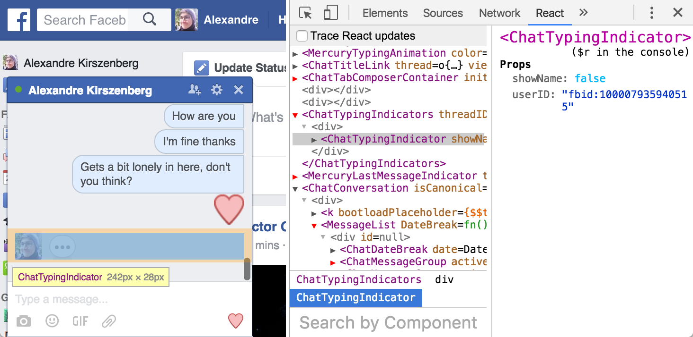</p>
  <p>
    <em>
      Aye, the mighty ChatTypingIndicator.
    </em>
  </p>
</div>


If you don’t manage to catch it in its natural habitat, you can still find it between the `<ChatTabComposerContainer />` and the `<MercuryLastMessageIndicator />`.

Alright, now that we have a better idea of what we’re hunting, let’s look into the entrails of the beast. I’ll stop the metaphor here.

Searching for `__d('ChatTyping` in the React codebase yields two modules: `ChatTypingIndicator.react.js`, and `ChatTypingIndicators.react.js`, which is the one we’re looking for. Note the `.react` prefix, which indicates that the module exports a React component.


<div style="text-align: center;">
  <p>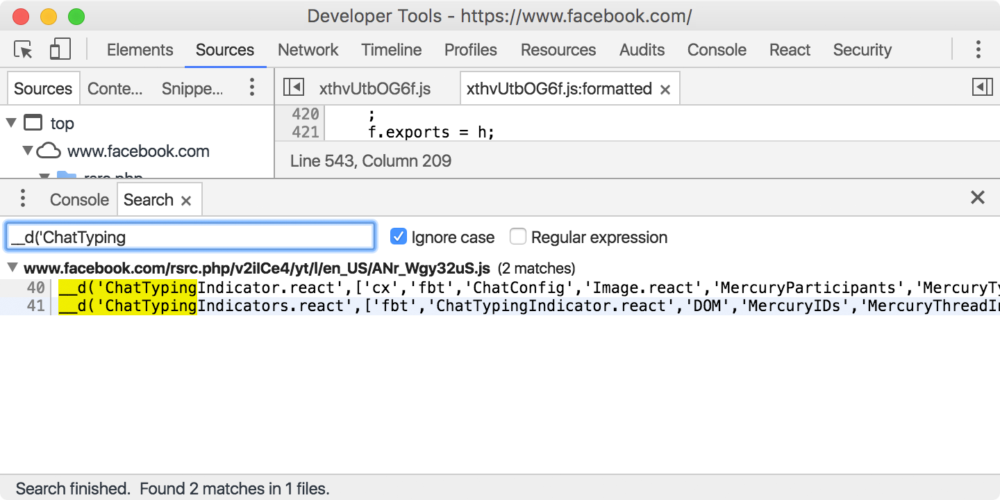</p>
</div>


If you can’t find the `ChatTypingIndicators.react.js` module, you should open a chat box and try again. Some modules are only loaded when they’re really needed.

## Anatomy of a React Component

During its life, a React Component will fire a few lifecycle hooks. For instance, right after it is mounted in the DOM, the `componentDidMount` method is called on the component instance.

This method is the preferred place to subscribe to events and/or asynchronously load data, so that’s where we’re going to look first!


<div style="text-align: center;">
  <p>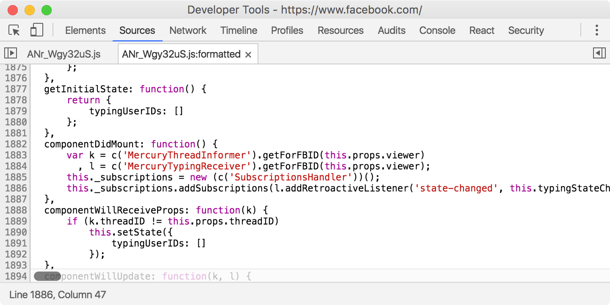</p>
  <p>
    <em>
      Yep, looks about right.
    </em>
  </p>
</div>


And here’s a full view of the code:


```js
function() {
  var k = c('MercuryThreadInformer').getForFBID(this.props.viewer)
    , l = c('MercuryTypingReceiver').getForFBID(this.props.viewer);
  this._subscriptions = new (c('SubscriptionsHandler'))();
  this._subscriptions.addSubscriptions(
    l.addRetroactiveListener(
      'state-changed',
      this.typingStateChanged
    ),
    k.subscribe(
      'messages-received',
      this.messagesReceived
    )
  );
},
```

See that `c('MercuryTypingReceiver')` call? That’s the minified version of `require('MercuryTypingReceiver')`. So we’re retrieving a very unambiguously named `MercuryTypingReceiver`, and we’re telling it to call the `typingStateChanged` method whenever its internal state changes. Our little module here is starting to look a lot like a Flux store. But we don’t really need to know how it works, this `addRetroactiveListener()` method looks just like what we were looking for.


<div style="text-align: center;">
  <p>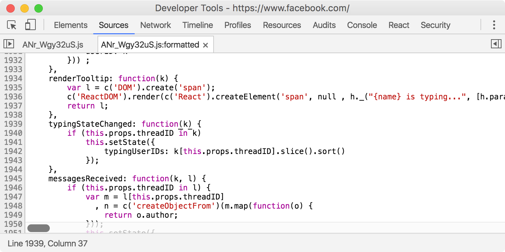</p>
</div>


Peeking at the `typingStateChanged` method, we can get an idea of the structure of the state of our `MercuryTypingReceiver` store. It looks like a dictionary that maps thread ids to an array of typing user ids. We’ll get back to it later, for now, let’s try to use this `MercuryTypingReceiver`!

## MercuryTypingReceiver

Using our new friend the `require` function, we can inspect `MercuryTypingReceiver` right there in our console. Let’s give it a look!

```js
> const MercuryTypingReceiver = require('MercuryTypingReceiver');
// undefined
> MercuryTypingReceiver
// function j(k){/* bunch of gibberish */}
```

That doesn’t look too good. As we’ve seen before, `MercuryTypingReceiver` has a `getForFBID` static method. However, the Chrome devtools do not let us inspect function properties directly. To circumvent that, let’s wrap it in an object:


<div style="text-align: center;">
  <p>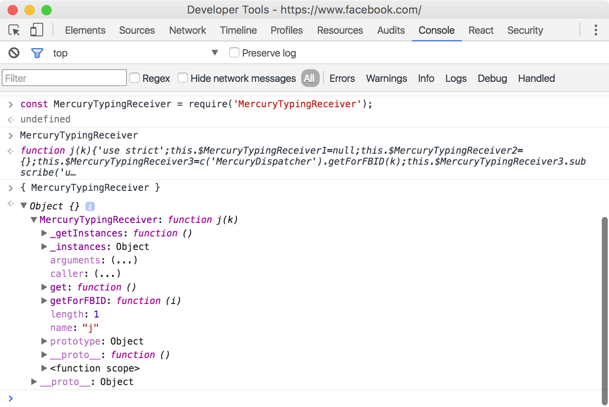</p>
  <p>
    <em>
      Much better!
    </em>
  </p>
</div>

And now let’s take a look at both its public static methods, `get` and `getForFBID`:

```js
> MercuryTypingReceiver.getForFBID
// function (i){var j=this._getInstances();if(!j[i])j[i]=new this(i);return j[i];}
> MercuryTypingReceiver.get
// function (){return this.getForFBID(c('CurrentUser').getID());}
```

From this, we can assert that `MercuryTypingReceiver.getForFBID(fbid)` retrieves a `MercuryTypingReceiver` instance from a `FBID` string, while `MercuryTypingReceiver.get()` is just a utility function that retrieves the `MercuryTypingReceiver` instance of the current user. We’re going to forget about `getForFBID()` and just use `get()`.

You’ll remember that our React component called the `addRetroactiveListener(eventName, listener)` method on a `MercuryTypingReceiver` instance. Using it is very simple:

```js
const inst = MercuryTypingReceiver.get();
inst.addRetroactiveListener('state-changed', state => {
  console.log(state);
});
```

Now, if you did receive a typing status notification while you were playing in the console, you might already see some state objects get printed out. Otherwise, a simple way to test this is to write to yourself! You can use the Messenger app on your phone to send out the typing events.


<div style="text-align: center;">
  <p>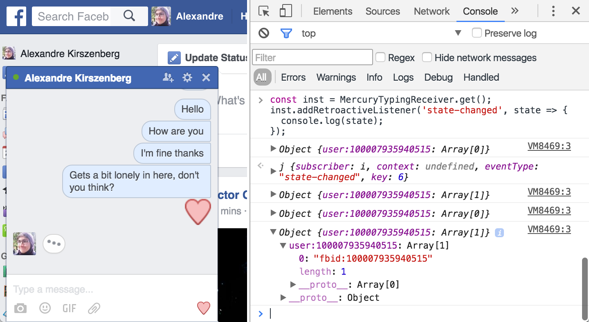</p>
  <p>
    <em>
      On my way to insanity.
    </em>
  </p>
</div>


Alright! This corroborates what we asserted before: our `MercuryTypingReceiver` store’s state is just an dictionary that maps a thread id to the ids of all the users currently typing in that thread.

This information is what we’re looking for, but without a way to link a thread id to the thread’s name or a user id to the user’s full name, it really doesn’t tell us much.

## MercuryThreads and ShortProfiles

A little more snooping around the code reveals two very useful modules:

* `MercuryThreads` lets use retrieve all information about a Messenger thread from its id.
* `ShortProfiles` does the same, but with user profiles.

We can even batch those in order to retrieve information about multiple threads and users at the same time!

I won’t go into further details regarding the API of either of those, as I think the code below is rather self-explanatory.

## Finally, the Code

All 40 lines of it.

`gist:alexkirsz/011ade925d7cd9a82c5e49b2a53bbc3c`

## Wrapping Up

I think the biggest biggest takeaway of this blog post is how easy it is to hook into the code of a well-structured modern web application. The combination of Javascript modules, React and Flux allows us to inject our own logic into both the UI and the data flow of an app.

You’ll find the [entire source code of the app on Github](https://github.com/alexkirsz/facebook-sixth-sense). **June 9:** *removed from Github in compliance with a Cease and Desist*.

That’s it! Hope you’ve enjoyed the read. If you have any questions, you can ping me on twitter [@alexkirsz](https://twitter.com/alexkirsz).

